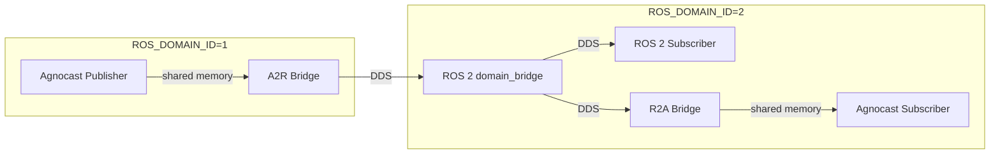

# Domain Bridge

Agnocast honors `ROS_DOMAIN_ID`: a publisher and a subscriber connect only when they share the same domain, matching ROS 2 semantics. (Earlier versions ignored the domain — every Agnocast endpoint in an IPC namespace connected to every other one.)

To connect a topic across two domains, run the external [ROS 2 `domain_bridge`](https://github.com/ros2/domain_bridge) node, and give Agnocast the same YAML config so it can bring up the [Agnocast–ROS 2 Bridge](../migration-guide/bridge.md) that node relays from.

!!! warning "The zero-copy domain bridge is unsupported"
    Agnocast also has a kernel-module path that delivers a topic across two domains with zero copy, whose rules are registered with `register_domain_bridge`. It is incomplete and not supported — do not use it, including on Agnocast 2.4.0, which does not yet warn about it. Later versions print a warning on every `register_domain_bridge` run, and the kernel module warns once per load when a rule is registered.

## How it works

The `domain_bridge` node relays over DDS, so a topic published only by Agnocast nodes needs an Agnocast→ROS 2 (A2R) bridge in the source domain. On its own, neither side would start: the A2R bridge waits for a DDS subscriber, while `domain_bridge` waits for a DDS publisher. The Agnocast discovery agent breaks this by reading the `domain_bridge` config and bringing up the A2R bridge for every topic it bridges out of the agent's domain.

In the destination domain, `domain_bridge` publishes over DDS. ROS 2 subscribers receive it directly, and Agnocast subscribers receive it through the ordinary on-demand ROS 2→Agnocast (R2A) bridge.

## Requirements

- **The Agnocast–ROS 2 Bridge must be on** (`AGNOCAST_BRIDGE_MODE`, on by default). With it off, there is no bridge for the discovery agent to bring up. See [Bridge Modes](../migration-guide/bridge.md#bridge-modes).
- **The discovery agent must see the config.** It reads `/etc/agnocast/domain_bridge.yaml` by default. See [Configuration](configuration.md#where-the-file-goes).
- **Messages are copied.** The path goes through DDS, with serialization, like any other traffic through the Agnocast–ROS 2 Bridge.

## Next steps

- [Configuration](configuration.md) — write the config, place it where the discovery agent reads it, and run `domain_bridge` with it.
