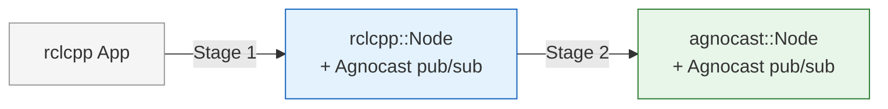

---
hide:
  - navigation
---

# Agnocast

**Agnocast is a rclcpp-compatible true zero-copy IPC middleware that supports all ROS message types, including message structs already generated by rosidl.**

ROS 2 supports a wide variety of languages, operating systems, and network transports (RMWs), making it easy to build robotics applications across diverse environments. You can first build your application with ROS 2, then, once you need more performance, gradually migrate the parts that are already working to Agnocast, step by step, and ultimately pursue the best possible performance.

Currently, **Linux (Ubuntu)** and **C++ (rclcpp)** applications are supported. Whether support for other OSes or language bindings will be added in the future is undecided.

## Key Features

- **True zero-copy IPC** — No serialization, no copies, no compromise. Agnocast delivers messages through shared memory with zero overhead, and it works with every ROS message type out of the box — including structs already generated by rosidl.
- **Drop-in migration** — Existing rclcpp applications can adopt Agnocast incrementally. A two-stage migration path lets you gain zero-copy performance immediately, then optionally bypass the rcl layer entirely for even lower latency and CPU usage.
- **Per-callback scheduling** — Assign thread priority and CPU affinity per CallbackGroup via a simple YAML file. The CallbackIsolatedExecutor gives you real-time-grade control over exactly which callbacks run where and when.
- **ROS 2 interoperability** — The Agnocast-ROS 2 Bridge lets Agnocast nodes and standard RMW-based nodes coexist in the same system. Adopt gradually — no big-bang rewrite required.

---

## Two-Stage Migration

Existing rclcpp applications can be rewritten in two stages, with performance gains at each stage.

| Stage | Node Class | What Changes | Performance Gain |
|-------|-----------|-------------|-----------------|
| **Stage 1** | `rclcpp::Node` (unchanged) | Rewrite publishers, subscriptions, and smart pointers to use Agnocast APIs | Zero-copy IPC for Agnocast topics |
| **Stage 2** | `agnocast::Node` | Replace the node base class (requires all pub/sub in the node to be Agnocast-ized) | Bypass rcl layer — reduced launch time and CPU usage |

The [Agnocast-ROS 2 Bridge](migration-guide/bridge.md) enables interoperability between Agnocast and standard ROS 2 nodes at any stage. It offers three modes — Off, Standard, and Performance — so you can start simple and optimize later.

See the [Migration Guide](migration-guide/index.md) for details and code examples.

---

## Supported Environments

| Component | Supported Versions |
|-----------|-------------------|
| ROS 2 | Humble / Jazzy (rclcpp only) |
| Linux | Ubuntu 22.04 / 24.04 |
| Kernel | 5.x / 6.x series |

Both Humble and Jazzy use Agnocast major version **2**. The major version is fixed within a ROS 2 distribution and will not change during its lifetime. See the [versioning rules](environment-setup/index.md) in Environment Setup for details.

---

## Limitations

Because Agnocast delivers messages by sharing the publisher's in-memory representation directly with subscribers, both ends must agree on that representation exactly. This assumption shapes most of the current limitations.

### Memory layout must match between publisher and subscriber

Agnocast does **not** serialize messages. The publisher and subscriber read and write the same bytes in shared memory, so the in-memory layout of the message type — field order, padding, alignment, and ABI of any nested types — must be byte-for-byte identical on both sides.

In practice this holds automatically when all nodes are built against the same ROS 2 distribution, since the C++ ABI is stable across typical compiler versions. The realistic failure mode — most likely when publisher and subscriber are built in **different containers** — is mismatched `_GLIBCXX_USE_CXX11_ABI` settings, which change the layout of `std::string` and other standard types. Mismatched layouts will not produce a clean error; subscribers will simply read corrupted data.

### Single ECU, single IPC namespace

Agnocast pub/sub only works between processes that share the same Linux IPC namespace on the same machine.

- **Cross-ECU communication:** When an Agnocast publisher and subscriber on the same topic live on different ECUs, the Bridge is **not** automatically started to connect them. Each side will only see local endpoints. Automatic discovery of remote Agnocast endpoints and on-demand Bridge creation is on the roadmap.
- **Cross-IPC-namespace communication** is not supported. Containers must share an IPC namespace to communicate via Agnocast — see [Running in Containers](tips/containers.md). Native cross-namespace support is on the roadmap.

### Cross-domain communication is opt-in

Agnocast honors `ROS_DOMAIN_ID`: publishers and subscribers connect only within the same domain. To connect a topic across two domains on the same machine — with zero copy — register a rule with the [domain bridge](domain-bridge/index.md). There is no zero-copy path across ECUs or IPC namespaces; that still goes through the [Agnocast–ROS 2 Bridge](migration-guide/bridge.md).

### One message type per topic

A given Agnocast topic name must be used with a single message type across all publishers and subscribers. Publishing or subscribing to the same topic with different types is not supported.

### Other API-level limitations

**`message_filters`** does not support every policy and filter available in upstream ROS 2 — see the [compatibility table](migration-guide/message-filters.md).

---

## Links

- [Source Code (GitHub)](https://github.com/autowarefoundation/agnocast)
- [Design Documents (for developers)](https://github.com/autowarefoundation/agnocast/tree/main/docs)
